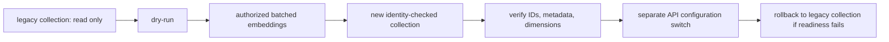

# Embedding index migration

An embedding model defines a semantic space; vectors from different models must never share a Chroma collection, even when their dimensions coincide.  The 1536-dimensional legacy `knowledge_chunks` collection remains immutable.  Qwen Flash 1024-dimensional vectors target `knowledge_chunks_qwen37_flash_1024` with identity metadata for provider, model, dimensions and `embedding_space_id`.

Dry-run reads only local Chroma metadata, IDs, vector dimensions and safe counts.  A future authorized migration will preserve vector IDs and provenance metadata, atomically record per-batch completion, and never alter MongoDB, Neo4j, the source collection, or benchmark history.  Interrupted runs resume only the IDs recorded in their migration state; rollback deletes only exact target IDs.

`MemoryService` persists embeddings in SQLite.  Each newly persisted memory now records an `embedding_space_id`; rows that have no identity or belong to another space are retained but skipped.  No memory migration or deletion occurs in this change.

The migration utility has a deliberately read-only `--dry-run` and a future-only execution gate: `--execute --authorized-embedding-migration`.  Execution is batch-resumable through an atomically replaced `migration-state.json`, preserves source vector IDs and metadata, and writes only the target collection.  A failed batch records only safe identifiers and an error category; it never alters the source collection.  After authorized completion, `verification.json` and `safe-summary.json` contain counts and identity checks, not text, vectors, endpoints, or credentials.

Before a configuration switch, the new target collection must pass identity and dimension verification.  Restart only the API with the new local configuration; readiness then verifies the configured collection and space.  If readiness fails, restore the previous collection/space configuration and restart the API.  The legacy collection is retained as the rollback path and is never deleted automatically.

Benchmark scores are specific to one embedding space and cannot be combined across migrations.
