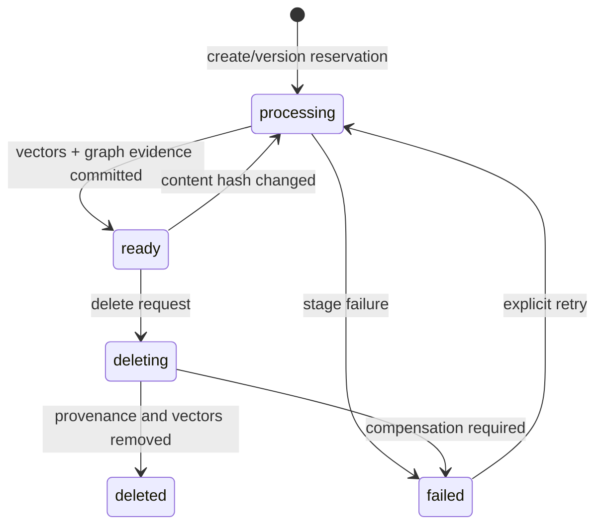
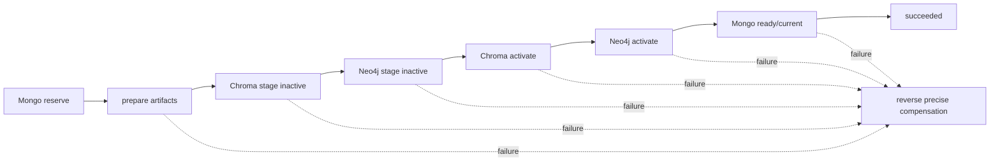

# S3：真正的增量知识更新设计

## 范围

本设计只定义后续实现的最小数据与 API 改造；不改变当前 core 运行行为。目标是让新增、重复上传、更新、删除与失败恢复可审计、幂等且不会误删共享图谱实体。

## Pre-S3 历史基线（保留用于解释改造原因）

| 项目 | 当前行为 | 缺陷 |
|---|---|---|
| `document_id` | `sha256(str(file_path))[:16]` | 依赖本机绝对路径；改名、迁移或覆盖同名文件会变更/碰撞语义。|
| 文件元数据 | 仅保存在上传目录；列表通过扫描文件系统生成 | 无持久状态、hash、版本、处理结果或失败原因。|
| 重复上传 | 同名文件先覆盖，再用相同路径 chunk ID 执行 Chroma upsert | 可能更新向量；图谱重复抽取，且没有内容 hash 快路径。|
| Chroma | ID 为 `{doc_id}#chunk-{index}`；metadata 为 `doc_id/doc_type/source/chunk_index` | 没有文档版本、内容 hash、活动版本或处理状态。|
| Neo4j | `(:Entity {name})` 全局 MERGE；关系全局 MERGE；`source` 为单值 | 后写来源覆盖前写来源；`delete_by_source` 删除节点会误删共享实体。|
| 更新/删除 | update 先删向量再重建；delete API 只删文件，更新 Agent 才尝试图谱删除 | 无跨存储事务、补偿或精确图谱 provenance。|
| QA | Chroma 检索未按文档状态/版本过滤；图谱同样不区分有效来源 | 未来可能召回过期或删除版本。|

该历史入口曾使用 `POST /api/ingest/upload`、按文件名删除和 `/api/admin/update`；旧
`KnowledgeUpdateAgent` 的版本计数与 source 都是进程内/路径级，不能作为持久版本模型。

## 推荐最小数据模型

本阶段实际引入两个独立于 checkpoint 的 MongoDB collection。默认
`namespace` 为 `default`；首次上传可提供 `logical_key`，否则使用安全规范化
后的文件名。`document_id` 只在首次保留逻辑文档时生成 UUID，后续版本不变。

`documents` 是逻辑文档登记册：

```json
{
  "document_id": "stable UUID",
  "namespace": "default",
  "logical_key": "normalized external key or upload name",
  "filename": "safe-display-name.pdf",
  "current_version": 3,
  "status": "processing|ready|failed|deleting|deleted",
  "created_at": "...",
  "updated_at": "...",
  "deleted_at": null
}
```

`document_versions` 保存不可变版本 identity 与处理结果：

```json
{
  "document_id": "stable UUID",
  "version": 3,
  "content_hash": "sha256 of upload bytes",
  "filename": "safe-display-name.pdf",
  "status": "processing|ready|failed|deleting|deleted",
  "is_current": true,
  "chunk_count": 12,
  "error_summary": "safe, truncated diagnostic",
  "created_at": "...",
  "updated_at": "...",
  "ready_at": "..."
}
```

MongoDB 唯一索引为 `(namespace, logical_key)` 和 `(document_id, version)`。`content_hash`
使用上传原始字节的 SHA-256，不依赖文件名；同一逻辑文档已有相同 hash 时返回
原版本且 `changed=false`，不创建 version 2，也不重复触发后续入库。

### Chroma provenance

本阶段已实现稳定 vector ID：

```text
{document_id}:v{document_version}:c{chunk_index}
```

每个新 chunk 的 Chroma metadata 只写 1.5.9 支持的标量，并包含：

```text
document_id, document_version, chunk_id, chunk_index, content_hash,
source, is_current, status, doc_type
```

`Path`、UUID、日期时间和其他对象在入库前转换为字符串；`source` 永远是展示
文件名，不保存或返回本机绝对路径。`stage_document_version` 以
`is_current=false,status=processing` 写入，并使用同一 ID 的 Chroma `upsert` 保证
重复 stage 不产生额外向量。

`activate_document_version` 先使同一 `document_id` 的旧 current 向量退出 current，
再将完整 stage 的新版本标记 `is_current=true,status=ready`。Chroma 没有跨记录事务：
激活中的异常会使已提升的新 ID 回到 processing、已退出的旧 ID 回到 ready/current，
然后继续抛出原始异常。stage 的逐 ID upsert 也会记录已写入 ID；部分失败时只删除
这一批 ID。

查询必须同时兼容旧 metadata（无版本字段）与新 metadata（必须 current 且 ready）。
Chroma where 不能可靠表示“字段缺失即 legacy”，所以实现使用最多 50 个候选的有界
over-fetch（`min(top_k * 5, 50)`），在应用层过滤后才截取 `top_k`。这保证 inactive、
failed 和 deleted 新格式向量绝不进入结果；代价是若前 50 个候选多数无效，结果可能少于
请求的 `top_k`，该限制在服务常量和离线测试中固定。

版本化 VectorStore 的精确管理接口为 `stage_document_version`、
`activate_document_version`、`deactivate_document_version`、
`delete_document_version`、`delete_document`、`count_document_version` 和
`list_document_vector_ids`。它们由 `DocumentUpdateCoordinator` 的 Saga 使用，不由旧
文件路径工作流或 CDC 直接调用。

### Neo4j provenance

本阶段已保留全局 `(:Entity {name})` 的旧唯一语义，并新增：

```text
(:Document {document_id})-[:HAS_VERSION]->(:DocumentVersion {document_id, version, content_hash, status})
(:DocumentVersion)-[:MENTIONS {chunk_id}]->(:Entity)
(:DocumentVersion)-[:MENTIONS]->(:Entity)
(:Entity)-[:<validated business type> {
  evidence_key, document_id, document_version, source, status, is_current
}]->(:Entity)
```

`DocumentVersion.key` 是 `{document_id}:v{document_version}`，并有 Neo4j 唯一约束。
新 business relationship 的 `evidence_key` 是 SHA-256：
`document_id + version + subject + predicate + object`。因此相同文档版本中的相同
事实通过 `MERGE` 幂等；不同版本或不同文档保留独立 relationship evidence。

现有动态 relationship type 保持兼容，但新写入仅允许最长 64 个字符的
`[A-Z][A-Z0-9_]*` 标识符；空格规范化为 `_`，其他输入一律回退到 `RELATED_TO`。
关系类型是唯一允许插入 Cypher 文本的位置，且已验证；head、tail、predicate、source
及所有其他属性始终是参数化值。

`stage_document_version` 在一个 Neo4j write transaction 内创建 processing/inactive
DocumentVersion、MENTIONS 和 evidence。事务内任一失败由 Neo4j rollback，不留下部分
provenance。`activate_document_version` 也在单一 transaction 内将旧 current 文档版本和
evidence 退出 current，再将新版本置 ready/current；失败自动保持旧状态。

删除仅匹配精确 `(document_id, document_version)` evidence、MENTIONS 和
DocumentVersion。随后只检查本次被删除版本曾 mention 的 Entity：若仍被任何
DocumentVersion mention、仍参与任何业务关系，均保留；只有两者皆无的孤立 Entity 才
在同一 transaction 内删除。实现不使用宽泛 `DETACH DELETE`。

GraphRAGPipeline 和实际 QAAgent 图谱检索现在都调用 version-aware neighbor/path 查询，
不再让模型生成的自由 Cypher 绕过 provenance filter。新格式关系必须
`is_current=true,status=ready`；完全缺少 provenance 字段的旧关系仍作为 legacy 可见。
该判断明确先检查 `document_id IS NULL`，因此 inactive 的新关系不能借 legacy 分支泄漏。
返回 context metadata 包含安全 `source`、`document_id`、`document_version`；相同事实的
多文档 evidence 合并为一个 context 的 `sources` 列表。

## 状态流转与补偿



1. **本阶段新增**：上传前保留 `processing` 版本；现有 ingest workflow 成功后标为 `ready` 并切换 `current_version`。失败版本记录经过脱敏、最多 300 字符的 `error_summary`。
2. **幂等重复**：同 hash 不论其状态均返回已有版本和 `changed=false`；failed 的重试留给后续显式 retry API，避免隐式重复执行。
3. **后续更新**：永不先删除旧 current。创建新 processing 版本，成功后切换 current；失败时保留 failed 记录且旧 ready version 继续为 current。
4. **后续删除**：先置 `deleting`，删除精确 document/version vector IDs 和 Neo4j evidence，再标记 deleted；任一步失败保留 deleting/failed 和补偿任务，不删除登记册。

补偿操作必须按 `(document_id, version)` 幂等：重复调用只删除该版本资源，绝不通过全局 Entity `source` 删除。

## API 设计

| 方法 | 路径 | 行为 |
|---|---|---|
| POST | `/api/ingest/upload` | 保持旧 multipart 上传兼容；新增可选 `logical_key`，响应含 registry 字段。|
| GET | `/api/documents` | namespace 文档列表（如路由启用时由 registry 提供）。|
| GET | `/api/documents/{document_id}` | 文档及版本摘要。|
| GET | `/api/documents/{document_id}/versions` | 版本、hash、状态、计数。|
| GET | `/api/documents/{document_id}/status` | 逻辑文档当前状态。|
| PUT | `/api/documents/{document_id}` | multipart bytes 创建下一不可变 version。|
| DELETE | `/api/documents/{document_id}` | 精确 document Saga 删除其 versions 的向量与 provenance。|
| POST | `/api/documents/{document_id}/retry` | 计划中的 failed/deleting 补偿重试；本阶段尚未暴露。|

`/api/admin/update` 已退役并返回 `410`；它不检查、更不会接受本机 `file_path`。按文件名的
legacy delete 同样返回 `410`。所有正式写操作使用版本化 `/api/documents` 路由，不伪造跨存储成功。

## Legacy 兼容与迁移

旧 Chroma chunk 的 `doc_id` 为路径哈希，Neo4j source 为路径字符串。迁移时为每个已知上传文件建立 legacy Document/Version；无法关联的 vectors/nodes 标记 `legacy=true` 并保持检索可见。新 QA 过滤应将缺少状态字段的 legacy 记录作为 active，直到人工回填完成。禁止破坏性全库重建作为迁移前置条件。

## 测试清单

- 同 hash 重复上传不产生新 version/vector/evidence。
- Chroma vector ID 稳定；重复 stage 不增加数量；metadata 仅含标量且 source 安全。
- 当前版本激活、旧版本退出 current、精准版本/文档删除、部分写入和激活失败补偿。
- 检索过滤 inactive/failed/deleted，legacy 与 current 保持可检索，过滤后应用 top_k。
- Neo4j DocumentVersion/MENTIONS/evidence 幂等、关系类型验证、参数化、事务 rollback、
  共享 Entity 保护与 current/legacy GraphRAG 过滤。
- 更新失败保留旧 ready version；补偿仅清理失败 version。
- 删除只移除目标 version chunks/evidence，两个文档共享 Entity 时 Entity 仍存在。
- current 切换后 QA 不召回旧 version；legacy records 仍可召回。
- 并发相同 logical key 只产生一个版本 reservation。
- 每个状态、重试、删除与 API 兼容场景；无模型 mock parser/extractor/embedding。

## 本阶段实现与后续风险

本阶段新增 `services/document_registry.py`、Neo4j provenance 和离线测试，并修改
`api/main.py`、vector store、GraphRAG 与本文档。没有改动 `doc_parser_agent.py` 或真实
数据，也没有将 versioned Mongo/Chroma/Neo4j 方法接入上传工作流。下一阶段才会编排三个
存储的 stage、activate、rollback 与精确补偿。

主要风险是跨 Mongo/Chroma/Neo4j 无全局事务、旧路径哈希无法稳定关联、以及关系 evidence 模型增加图查询复杂度。推荐先实现 Mongo 状态机 + Chroma 版本化，再实施 Neo4j provenance；每步保留 legacy 读兼容与可重试补偿。

## 跨存储 Saga 协调器（本阶段实现）

`DocumentUpdateCoordinator` 是构造函数注入的编排层：它只复用
`DocumentRegistry`、`VectorStore`、`KnowledgeGraphService` 和一个异步
`DocumentProcessor`；不创建新的 Mongo、Chroma 或 Neo4j client，也尚未接入任何
HTTP 上传、更新或删除路由。processor 的 chunks、实体、关系和 embedding 只存在于
内存，绝不写入操作日志。

创建和更新严格按以下顺序执行。更新在创建下一个版本前先获取 document scoped lease，
从而不会因被拒绝的并发更新留下一个新的 processing version。



Mongo 的 `current_version` 只在最后的 `Mongo ready/current` 步骤切换。content hash
未变化的 reserve 会立即返回 `changed=false`，不会调用 processor、Chroma 或 Neo4j。
调用者可传入稳定的 `operation_id`；同一 ID 的重试返回/恢复已有 journal，而不会再写入
相同 vector 或 evidence。

### Operation journal 与锁

`document_operations` 记录以下安全字段：

```text
operation_id, operation_type, document_id, version, previous_current_version,
status, completed_steps, compensation_steps, vector_ids, graph_evidence_keys,
error_summary, created_at, updated_at
```

`operation_id` 建有唯一索引；每个完成步骤立即追加到 `completed_steps`。journal 不保存
文档全文、chunks、embeddings、模型 prompt、密钥或连接串。错误经统一清洗、截断后才可
保存到 `error_summary`。

`document_operation_locks` 以 `document_id` 唯一索引实现可过期 lease，记录
`operation_id`、`expires_at` 和审计时间。只有同一 operation 可以续租或释放锁；不同
document 可并行。遇到过期 lease，恢复操作可以接管；未过期的 running operation 不会被
`reconcile_incomplete_operations()` 猜测或干预。此锁是 Mongo 持久记录，并非进程内 mutex。

### 补偿矩阵

补偿只依据 journal 已确认的 `completed_steps`，按反向依赖顺序执行，所有调用均带精确的
`(document_id, version)`：

| 已完成的步骤 | 精确补偿 | 旧 current 的处理 |
|---|---|---|
| `vector_staged` | 删除该 version 的 vector IDs | 不变 |
| `graph_staged` | 删除该 version 的 DocumentVersion/MENTIONS/evidence | 不变；共享 Entity 由图服务保护 |
| `vector_activated` | 先 deactivate 新版本，再恢复 previous version | 旧 vector 回到 ready/current |
| `graph_activated` | 先 deactivate 新版本，再恢复 previous version | 旧 graph evidence 回到 ready/current |
| 尚未 `mongo_ready` 的任意失败 | 将新 Mongo version 标记 `failed` | `current_version` 不切换 |

补偿步骤本身也写入 journal，故中断后再次恢复不会重复执行已经完成的清理。补偿失败会将
operation 标记为 `needs_reconciliation`，并保留安全错误摘要；原始业务错误仍向调用者
传播，绝不伪造成功。

### 删除、恢复与对账

删除采用两阶段策略：Mongo `deleting` → 精确 deactivate vector → 精确 deactivate graph
provenance → Mongo `deleted` → 精确物理删除 vector/document provenance。物理清理失败时，
Mongo 仍为 `deleted`，operation 变为 `cleanup_pending`，因此该文档不会重新进入检索；
不会回滚为 ready，也不会影响其他文档或共享 Entity。

`recover_operation(operation_id)` 是显式、幂等入口：它对 `cleanup_pending` 重试物理清理，
对其他非成功记录按 journal 执行补偿。`reconcile_incomplete_operations()` 仅处理过期的
`running`、`compensating`、`cleanup_pending` 和 `needs_reconciliation`；不会自动在应用
启动时运行，也不会处理已成功 operation。运维方可在确认服务实例停止或 lease 过期后显式
执行该入口完成崩溃恢复和人工对账。

### 下一阶段接入边界

下一阶段可把当前上传 pipeline 的真实 parser/extractor 适配为 `DocumentProcessor`，并只从
已验证的 HTTP 路由调用 coordinator。接入前必须补充真实部署环境的 Mongo 唯一索引创建、
操作 ID 透传、超时/lease 续租、管理员 retry/reconcile 接口及受控的端到端验收；本阶段不
修改 PUT/DELETE 的 `501` 行为，也不接触任何真实存储数据。

## DocumentProcessor 适配器（本阶段实现）

`services/document_processor.py` 实现了注入式 `DocumentProcessorAdapter`。它不创建
Chat/Embedding provider，也不复制 parser prompt 或 extraction prompt：调用方传入已经
配置好的 `DocParserAgent`（或等价 parser）和 `KnowledgeExtractAgent`（或等价 extractor），
适配器分别调用其现有的 `parse(path)` 与 `extract(chunks)` 公共方法。Embedding 始终由
后续的 `VectorStore` 和 embedding provider 生成；处理产物不携带 embedding。

协调器的 processor 契约现为：

```text
prepare(content, filename, document_id, version, content_hash, operation_id)
  -> PreparedDocument(
       document_id, document_version, content_hash, source,
       chunks, entities, relations, processing_metadata)
```

`PreparedDocument` 只在 Saga 当前进程的内存中存在，操作 journal 不保存其正文、chunks、
embeddings 或模型输出。`processing_metadata` 仅包含 operation ID、解析/抽取耗时和各对象
计数。安全 audit 事件也仅包含这些 ID、计数、耗时、phase 和失败类型。

### 临时文件与输入安全

现有 parser 的公开 API 需要文件路径，因此 adapter 只接受上传 bytes 与 filename，并在
注入的 `temp_root` 下通过唯一临时文件调用 parser。它先将 filename 变成纯显示名称：去除
正反斜杠、盘符/UNC 路径组成、`..` traversal 和 Windows 非法字符；临时路径 resolve 后必须
仍位于 `temp_root` 内。无论 parser 或 extractor 成功、失败还是超时，`finally` 都只删除本次
唯一临时文件，既不记录完整路径，也不删除整个临时目录。

### 产物验证与标准化

- chunks 必须非空，索引排序后为连续的 `0..N-1`；文本为空直接拒绝。
- adapter 将 parser 的路径哈希 doc ID 重写为 registry 的稳定 `document_id`，并把安全
  `source`、version、content hash 和 chunk index 写入 JSON-safe metadata。
- `Path` 只保留文件名，UUID/datetime 转为字符串，其他 metadata 递归转换为 JSON 基础值；
  产物不含绝对路径或不可序列化对象。
- Entity 以 `(name, type)` 去重并排序；relation 以 `(head, safe predicate, tail, properties)`
  去重并排序。每个 relation endpoint 都必须有对应 Entity。predicate 复用
  `KnowledgeGraphService.safe_relationship_type`，不会把抽取结果直接拼入 Cypher。
- chunks、entities、relations 都有可注入上限；超限、空值或结构不一致都会显式失败，而不是
  截断后伪造成功。

异常按用途分类为 `UnsupportedDocumentType`、`DocumentParseError`、`EmptyDocumentError`、
`KnowledgeExtractionError`、`InvalidExtractionResult` 和 `ProcessingTimeoutError`。包装异常
保留原始异常为 cause；超时不重试、不吞掉，供下一阶段 HTTP 层做明确映射。

adapter 已由 FastAPI lifespan 以既有 parser/extractor 依赖构造，并连接到受控的 POST/PUT/
DELETE 代码路径；本阶段尚未对真实存储或真实模型执行该路径。下一阶段才会在获得明确授权后
进行真实 V1/V2 验收，并验证 operation ID、临时文件生命周期、超时和管理员 recovery 流程。

## FastAPI 接入（本阶段实现，尚未进行真实验收）

FastAPI lifespan 现在复用同一轮生命周期已经创建的 chat provider、embedding provider、
`VectorStoreService`、`KnowledgeGraphService` 和 Mongo client。它以同一个 chat provider
构造 `DocParserAgent`、`KnowledgeExtractAgent` 和 `DocumentProcessorAdapter`，再把已有
`DocumentRegistry`、vector store、graph service 注入 `DocumentUpdateCoordinator`。没有新增
Mongo/Chroma/Neo4j/Chat/Embedding client；协调器不拥有 close 操作，原来的 shutdown 顺序仍由
lifespan 关闭 graph 与 Mongo client。依赖构造失败会阻止 lifespan 完成，而 readiness 同时检查
registry 和 coordinator，避免 API 对未完成依赖伪报 ready。

新增的同步 API 为：

| 方法 | 路径 | 行为 |
|---|---|---|
| POST | `/api/documents` | multipart create，支持 `logical_key`、`namespace=default` |
| PUT | `/api/documents/{document_id}` | multipart 创建下一不可变 version；ID 只能来自 path |
| DELETE | `/api/documents/{document_id}` | 精确 document Saga；已删除重复请求返回 `changed=false` |
| GET | `/api/documents/{document_id}`、`/versions`、`/status` | registry 查询 |
| GET | `/api/document-operations/{operation_id}` | operation 的安全摘要 |

POST/PUT 当前等待 coordinator 完成而返回 `200`，不是内存 background task。响应包含
operation ID、状态 URL、document/version/hash、`changed` 与兼容的 chunk/entity/relation
计数字段。operation journal 在处理执行期间持久化；API 重启后的恢复仍只由显式服务方法完成。
管理员鉴权尚不可靠，因此没有公开 recover 或 reconcile HTTP endpoint。

旧 `POST /api/ingest/upload` 是 create 的兼容别名；旧列表 URL 保留前端使用的
`id/name/size/upload_time/chunks_count`，同时加入 registry identity 与 version/status。前端删除
调用改为新的 document ID endpoint；旧按文件名 delete 已退役，避免绕过 Saga。

路由限制上传为 parser 支持的扩展名和最多 25 MiB 的 bytes；拒绝空文件、规范化 traversal/
drive/UNC filename，且不接受 `file_path` 参数。错误映射为 400（输入）、404（不存在）、409
（lease/状态冲突）、413（超限）、422（解析/抽取结果无效）、503（依赖不可用）与 504（超时）；
响应没有堆栈、连接串或 provider 原文。所有本阶段 API 验证都使用 FastAPI TestClient 和 fake
registry/coordinator，不运行 lifespan、不调用模型且不访问真实数据库。

## S3.5：唯一正式写入入口

`DocumentUpdateCoordinator` 是唯一正式的文档 create/update/delete 实现。调用链为
`POST|PUT|DELETE /api/documents` → Coordinator → Registry + versioned VectorStore + provenance-aware
KnowledgeGraphService。Coordinator 负责 operation journal、状态机、stage/activate 与失败补偿；
路由、LangGraph 和未来 CDC 都不得直接调用 Chroma 或 Neo4j 写入/删除方法。

`KnowledgeUpdateAgent` 已退役为只抛出 `DeprecatedUpdatePathError` 的兼容桩，不能再根据本机
路径生成 document ID，也不存在 delete-and-rebuild 分支。`delete_by_doc_id` 与 `delete_by_source`
仅保留用于人工确认的 legacy 迁移/维护清理；它们不属于 API、Coordinator 或未来 CDC 的允许路径。

Kafka/CDC 当前未实现。未来事件适配器只能验证稳定 `logical_key`，并将受控 bytes 或对象引用
提交给 Coordinator；不得将事件中的 `file_path`、任意 source 或自由文本当作删除条件，也不得
自行写入 MongoDB、Chroma 或 Neo4j。
